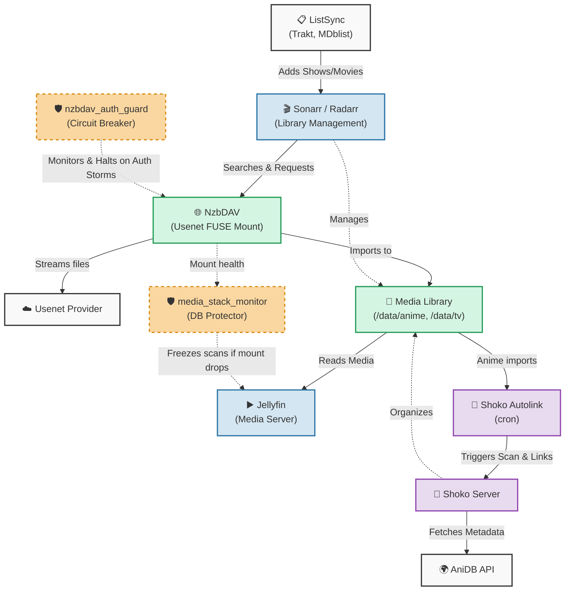

# Media Server Pipeline & Cron Scripts

This repository contains the complete set of cron jobs, watchdogs, and automation scripts that orchestrate my fully automated, Usenet-mounted media server pipeline. 

## The Pipeline Architecture

The media stack is designed to be fully automated from discovery to playback, heavily utilizing virtual filesystems (FUSE) to stream Usenet directly without requiring local storage for the entire library.

### 1. Discovery & Sync (`ListSync`)
The pipeline begins with automated list synchronization. Shows, movies, and anime added to lists (Trakt, MDblist, AniDB, etc.) are automatically synced to **Sonarr** and **Radarr**.

### 2. Management & Search (`Sonarr` / `Radarr`)
Sonarr and Radarr serve as the central library managers. They search indexers for releases and send them to the download client. However, instead of downloading files locally to a disk, the pipeline utilizes a virtual filesystem approach.

### 3. Virtual Filesystem (`NzbDAV` & `rclone` / FUSE)
Releases are streamed on-the-fly rather than downloaded. **NzbDAV** mounts Usenet providers as a local filesystem. Sonarr and Radarr are configured to interact with this mount. 
* To prevent Usenet provider bans from aggressive retries during network blips, `nzbdav_auth_guard.py` actively monitors connection pools and halts the container to act as a circuit breaker.

### 4. Anime Linking (`Shoko` & `Shoko Autolink`)
For anime, files imported by Sonarr are dropped into the library (`/data/anime/`). Because Shoko cannot automatically detect these filesystem changes on a network/FUSE mount, the **Shoko Autolink** sub-module explicitly triggers Shoko to scan the drop folders via API. 

**Shoko Server Hashing (The Primary Mapper)**: 
When Shoko scans the new files, it natively calculates their ED2K hash and cross-references it against the massive AniDB database. If the exact file hash is recognized (common for standard anime release groups), Shoko automatically links the file to the correct AniDB episode and pulls down the full metadata seamlessly.

**Shoko Autolink (The Ultimate Fallback)**:
When Shoko's native hash matching fails to find a match (which frequently happens with obscure releases, renamed files, or custom transcodes), the file is dumped into Shoko's "Unrecognized" queue. This is where **Shoko Autolink** steps in as the fallback. It automatically detects and links these unrecognized, TVDB-based anime episodes from Sonarr to their proper AniDB counterparts within Shoko by managing complex mapping rules, naming conventions, and API edge cases:
- **Smart Parsers**: Uses heuristic-based parsers to intelligently match sub-group tagged anime files (e.g., `[SubGroup] Series Name - 05 [1080p].mkv`).
- **Episode Offset Mappings**: Resolves complicated season/episode mappings (like split-cour series) by translating continuous absolute TVDB episodes to split AniDB seasons.
- **Fuzzy Name Matching**: Standardizes spaces and removes special characters to correctly link folders that have slightly different names in Sonarr vs. Shoko.
- **AniDB Ban Resilience**: Actively monitors Shoko's live API for HTTP ban statuses. If Shoko gets temporarily banned from AniDB, the script intelligently skips metadata refresh requests to prevent ban extensions, falling back to cached local mapping data!

### 5. Media Server (`Jellyfin`)
Jellyfin serves the media. Because Jellyfin's SQLite database is highly sensitive to underlying FUSE mounts disappearing (which can cause Jellyfin to assume the media was deleted and aggressively scrub its database), several watchdogs are employed:
* `media_stack_monitor.py` & `jellyfin_safe_refresh_wrapper.py`: These scripts actively monitor the health of the NzbDAV and rclone mounts. If a mount drops, they prevent Jellyfin from running library scans, effectively freezing Jellyfin until the mounts recover to prevent database corruption.

---

## The Scripts

The `scripts/` directory contains all the specialized automation that glues this stack together:

### Watchdogs & Monitors
- **`media_stack_monitor.py`**: Ensures Jellyfin doesn't corrupt its database if the underlying FUSE mounts crash.
- **`jellyfin_safe_refresh_wrapper.py`**: Wrapper to safely trigger Jellyfin scans only when mounts are healthy.
- **`nzbdav_auth_guard.py`**: Usenet auth-storm circuit breaker. Prevents account locks by halting NzbDAV on excessive auth failures.

### Sonarr / Radarr Helpers
- **`sonarr_import_guard.py`**: Protects the import queue from stalling.
- **`sonarr_import_rescue.py`**: Automatically rescues stuck imports using the Manual Import API.
- **`stage_sonarr_imports_tv.py`**: Handles staging and parsing of obfuscated Usenet TV imports.
- **`backlog_fetcher.py`**: Throttles and manages backlog fetching to prevent API rate limits and indexer bans.

### Shoko Autolink
The `shoko-autolink/` directory contains the complete pipeline for bridging Sonarr and Shoko:
- **`linker.py`**: The core execution engine.
- **`parsers/`**: Custom regex parsers for complex anime release groups.
- **`resolver.py`**: Handles ID mapping via `anime-lists` XML/JSON caches.

### Library Maintenance
- **`dedup_episodes.py`**: Cleans up duplicate episodes from Sonarr.
- **`sanitize_library.py`**: Cleans up unwanted files and metadata from the library.
- **`sanitize_movies.py`**: Fixes Radarr/Jellyfin movies stuck with NzbDAV hash filenames.
- **`library_stream_health.py`**: Periodically checks the health of media files to ensure they stream correctly.

### Infrastructure
- **`update_cloudflare_dns.py`**: Dynamic DNS updater for Cloudflare to keep the server remotely accessible.

## Setup

1. Copy `.env.example` to `.env` and fill in your API keys and configuration.
2. For Shoko Autolink, copy `shoko-autolink/config.example.yaml` to `shoko-autolink/config.yaml`.
3. Review `crontab.example` to see how these scripts are scheduled and executed in a production environment using `flock` to prevent overlapping runs.
