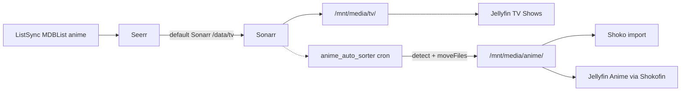

# Anime Auto-Sorter (`anime_auto_sorter.py`)

Reactive safety net that relocates anime series from Sonarr's `/data/tv` root folder to `/data/anime`.

## Problem

In a single-Sonarr setup where **ListSync** (or **Seerr**) syncs MDBList/Trakt anime lists, requests are submitted as `media_type=tv`. Seerr routes them to the default Sonarr server whose root folder is `/data/tv`. Sonarr often correctly classifies these as `seriesType=anime`, but the files still land under `/data/tv`.

Jellyfin's **TV Shows** library scans `/data/tv`; the **Anime** library is fed by **Shoko/Shokofin VFS**, which only sees `/mnt/media/anime`. Anime stuck in `/data/tv` never appears in the Anime library.

This script closes that gap without requiring a second Sonarr instance.

## How It Works



Every 15 minutes (offset from the Jellyfin refresh cron), the script:

1. Queries Sonarr for series under `/data/tv`.
2. Classifies anime using tiered detection rules.
3. Moves matches to `/data/anime` via Sonarr's editor API (`moveFiles=true`).
4. Triggers Shoko `RunImport` and a guarded Jellyfin library refresh.

Because `/data/tv` and `/data/anime` share the same filesystem, moves are atomic renames that **preserve symlinks** into the NzbDAV FUSE mount.

## Detection Rules

| Tier | Condition | Action |
|------|-----------|--------|
| **Tier 1** | `seriesType == "anime"` | Auto-move |
| **Tier 2** | `"Anime"` in genres **and** original language is Chinese/Japanese/Korean | Auto-move |
| **Tier 2** | `"Anime"` in genres **and** TVDB ID found in `anime-list.xml` | Auto-move |
| **Ambiguous** | `"Anime"` genre but English language and no anime-list hit | Log to review file; **do not move** |
| **Denied** | TVDB ID or title in denylist | Skip |

Western live-action shows (e.g. The Bear, Severance) are never classified because they lack the Anime genre tag.

## Safety Guards

- **Dry-run by default** — requires `--execute` to move anything.
- **Mount-health check** — aborts if `/mnt/nzbdav` is down or symlinks don't resolve (same canary approach as `jellyfin_safe_refresh_wrapper.py`).
- **Per-run cap** — default 10 series per run (`MOVE_LIMIT` env var).
- **Denylist** — manual overrides at `~/anime-auto-sorter/denylist.json`.
- **Single Jellyfin refresh** — skips if a "Scan Media Library" task is already running (prevents double-refresh stalls).
- **Single instance** — cron uses `flock`.
- **Runs as uid 1000** — never as root.

## Installation

```bash
# Copy script to the server
cp scripts/anime_auto_sorter.py /home/admin/anime_auto_sorter.py
chmod +x /home/admin/anime_auto_sorter.py

# Create state directory
mkdir -p /home/admin/anime-auto-sorter
echo '{"tvdbIds": [], "titles": []}' > /home/admin/anime-auto-sorter/denylist.json
```

Ensure Shoko credentials exist at `/home/admin/shoko-autolink/.env`:

```
SHOKO_USERNAME=your_user
SHOKO_PASSWORD=your_password
```

Add the cron entry from `crontab.example` (offset from Jellyfin refresh):

```
7,22,37,52 * * * * flock -n /home/admin/anime-auto-sorter/.lock \
  /usr/bin/python3 /home/admin/anime_auto_sorter.py --execute \
  >> /home/admin/anime-auto-sorter/anime-auto-sorter.log 2>&1
```

## Usage

```bash
python3 ~/anime_auto_sorter.py              # dry-run (shows plan, no changes)
python3 ~/anime_auto_sorter.py --execute    # move (capped) + Shoko + Jellyfin
python3 ~/anime_auto_sorter.py --status     # counts, mount health, last run
python3 ~/anime_auto_sorter.py --list-ambiguous   # print review queue
python3 ~/anime_auto_sorter.py --check      # mount-health only (exit 0=OK)
python3 ~/anime_auto_sorter.py --execute --limit 5   # move at most 5
python3 ~/anime_auto_sorter.py --execute --no-refresh  # move only, skip downstream
```

## Configuration (Environment Variables)

| Variable | Default | Purpose |
|----------|---------|---------|
| `SONARR_URL` | `http://127.0.0.1:8989/api/v3` | Sonarr API base |
| `SONARR_CONFIG` | `/opt/sonarr/config/config.xml` | Fallback API key source |
| `SONARR_API_KEY` | (from config.xml) | Override API key |
| `TV_ROOT` | `/data/tv` | Source root folder |
| `ANIME_ROOT` | `/data/anime` | Destination root folder |
| `JELLYFIN_URL` | `http://127.0.0.1:8096` | Jellyfin base URL |
| `JELLYFIN_DB` | `/opt/jellyfin/config/data/data/jellyfin.db` | Token source |
| `SHOKO_URL` | `http://127.0.0.1:8111` | Shoko Server base URL |
| `SHOKO_ENV` | `/home/admin/shoko-autolink/.env` | Shoko credentials file |
| `ANIME_LIST_XML` | `/opt/shoko-autolink/data/anime-list.xml` | TVDB→AniDB cross-check cache |
| `MOVE_LIMIT` | `10` | Max series moved per run |
| `STATE_DIR` | `/home/admin/anime-auto-sorter` | State, denylist, review, log |
| `ANIME_LANGS` | `Chinese,Japanese,Korean` | Trusted languages for Tier 2 |

## State Files

All under `~/anime-auto-sorter/`:

| File | Purpose |
|------|---------|
| `denylist.json` | TVDB IDs / titles to never move (`{"tvdbIds": [], "titles": []}`) |
| `state.json` | Audit trail of moved series + lifetime count |
| `review.json` | Ambiguous items awaiting manual decision |
| `anime-auto-sorter.log` | Structured run log |

### Denylist Example

To keep a show in TV Shows despite Anime genre tagging:

```json
{
  "tvdbIds": [393190],
  "titles": ["Star Wars: Visions"]
}
```

## Rollback

To revert a specific move, either:

1. Add the TVDB ID to the denylist, then in Sonarr UI change the series root folder back to `/data/tv` with "Move Files" checked.
2. Or call the editor API directly:

```bash
curl -X PUT "http://127.0.0.1:8989/api/v3/series/editor" \
  -H "X-Api-Key: $SONARR_API_KEY" \
  -H "Content-Type: application/json" \
  -d '{"seriesIds": [<id>], "rootFolderPath": "/data/tv", "moveFiles": true}'
```

To disable the automation entirely, comment out the cron line.

## Testing

```bash
python3 -m pytest scripts/tests/test_anime_auto_sorter.py -q
```

## Troubleshooting

| Symptom | Likely cause | Fix |
|---------|-------------|-----|
| Anime still in TV Shows after move | Jellyfin scan hasn't finished | Wait for validating scan; check `~/anime-auto-sorter.log` |
| `SKIP(mount)` in log | NzbDAV FUSE mount down | Fix mount via `media_stack_monitor.py` or restart rclone |
| Show in review.json | English-language anime anthology | Add to denylist or move manually in Sonarr |
| Jellyfin refresh skipped | Scan already running | Normal; next run will refresh |
| Shoko RunImport failed | Missing `.env` creds | Fill in `SHOKO_USERNAME` / `SHOKO_PASSWORD` |
